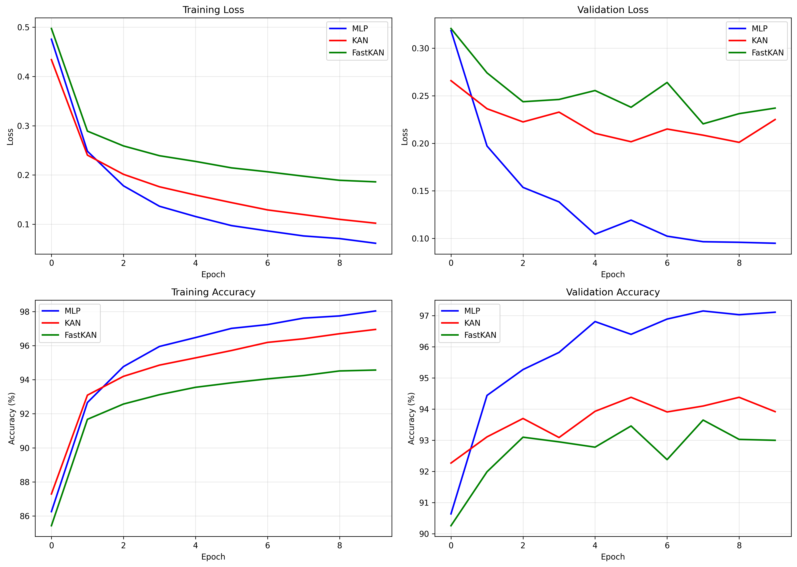
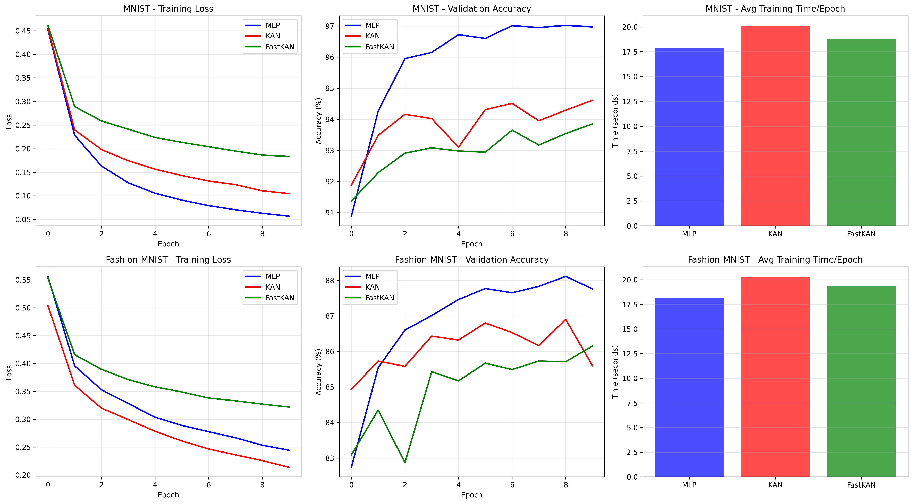
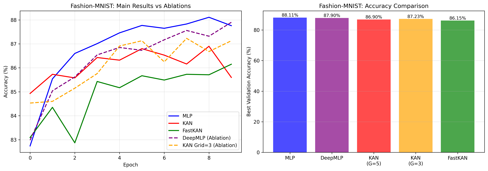

# KAN vs. MLP: Computer Vision Benchmark under Strict Parameter Constraints

## Overview
This repository contains a rigorous empirical benchmark comparing **Kolmogorov-Arnold Networks (KAN)** and their variant **FastKAN** against standard **Multi-Layer Perceptrons (MLP)** on basic computer vision tasks.

Unlike many theoretical studies that utilize large models, this project enforces a strict **~100k parameter budget** across all architectures. This constraint simulates real-world resource-limited environments, such as edge devices, providing a pragmatic assessment of architectural efficiency.

**Full Report:** [View PDF Report](./plots/cmpe460.pdf)

## Key Findings
Based on 10-epoch training runs on an NVIDIA RTX 3060, the following conclusions were drawn:

1.  **MLP Superiority at Low Parameter Counts:** The standard MLP architecture outperformed both KAN and FastKAN in accuracy, training speed, and convergence rate on both MNIST and Fashion-MNIST datasets.
2.  **Inefficiency of Complex KAN Grids:** Reducing the KAN spline grid size from $G=5$ to $G=3$ resulted in improved accuracy (+0.33% on Fashion-MNIST). This indicates that standard KAN configurations may over-allocate limited parameters to complex edge functions rather than necessary network width.
3.  **Computational Overhead of Splines:** Despite using optimized vectorized implementations (`EfficientKAN`), KAN models were approximately **15% slower** per training epoch than standard MLPs due to the mathematical complexity of spline evaluation.

### Performance Summary (Fashion-MNIST)
| Model | Accuracy | Parameters | Training Time (RTX 3060) |
| :--- | :--- | :--- | :--- |
| **MLP (Baseline)** | **88.11%** | **109,386** | **18.19s / epoch** |
| KAN (Efficient) | 86.90% | 107,190 | 20.29s / epoch |
| FastKAN | 86.15% | 108,034 | 19.34s / epoch |

## Visualizations

### Training Dynamics
The MLP (blue curve) demonstrates significantly faster initial convergence and maintains a higher accuracy plateau throughout the training process compared to KAN variants.


### Aggregate Performance Comparison
The performance gap between architectures widens on the more complex Fashion-MNIST dataset (bottom row), highlighting the struggle of KANs to extract rich visual features under tight parameter constraints.


### Ablation Studies (Fashion-MNIST)
Ablation tests confirm the robustness of these findings. Reducing grid sensitivity (left dashed lines) improved KAN performance, while increasing MLP depth (right bars) did not alter its superiority.


## Reproduction

This project utilizes **Poetry** for strict dependency management and **Jupyter** notebooks for experimental execution.

### Installation
```bash
git clone [https://github.com/atakang7/cmpe460report.git](https://github.com/atakang7/cmpe460report.git)
cd cmpe460report
poetry install
```

### Execution
Activate the virtual environment:
```bash
poetry shell
```
Launch Jupyter Lab or Notebook to run the experiments:
* **`main.ipynb`**: Executes the core 6 benchmarks (3 models x 2 datasets), generates standard training curves, and saves model checkpoints.
* **`ablation.ipynb`**: Executes the mandatory ablation studies (Grid Sensitivity Analysis and Structural Depth Tests) on Fashion-MNIST.

## Repository Structure
* `main.ipynb`: Primary benchmark runner.
* `ablation.ipynb`: Supplementary ablation studies.
* `experiment_results.txt`: Raw execution logs for verification of reported metrics.
* `data/`: Directory for cached datasets (MNIST/Fashion-MNIST).
* `saved_models/`: PyTorch state dictionaries (.pth) for all trained models.
* `plots/`: Generated figures used in the report and this README.
* `pyproject.toml` / `poetry.lock`: Dependency specifications.

## References
1.  Hornik, K., et al. (1989). *Multilayer feedforward networks are universal approximators.* Neural Networks, 2(5).
2.  Li, Z. (2024). *Kolmogorov-Arnold Networks are Radial Basis Function Networks (FastKAN).* arXiv:2405.06721.
3.  Liu, Z., et al. (2024). *KAN: Kolmogorov-Arnold Networks.* arXiv:2404.19756.
4.  Poeta, E., et al. (2024). *A benchmarking study of Kolmogorov-Arnold Networks on tabular data.* arXiv:2406.14529.
5.  Prince, S. J. D. (2023). *Understanding Deep Learning.* MIT Press.
6.  Yu, R., et al. (2024). *KAN or MLP: A Fairer Comparison.* arXiv:2407.16674.